# Praktikum Probstat D 2021

Nama : Graidy Megananda\
NRP  : 5025201188\
Kelas: D

---

## Tabel Konten
- [Soal 1](#nomor-1)
- [Soal 2](#nomor-2)
- [Soal 3](#nomor-3)
- [Soal 3](#nomor-4)
- [Soal 3](#nomor-5)
- [Soal 3](#nomor-6)

---

## Nomor 1
**[Source Code Nomor 1](https://github.com/Graidy27/P1_Probstat_D_5025201188/blob/main/Nomor%201.R)**\
### a
Foto hasil:

- Dari soal diketahui x bernilai 3 dan probabilitas (p) bernilai 0.2.
- Dengan menggunakan fungsi bawaan `dgeom`, maka peluang distribusi geometrik dapat dicari. 
- Nilai tersebut kemudian dimasukkan ke dalam variabel `ans_a`

### b
Foto hasil:
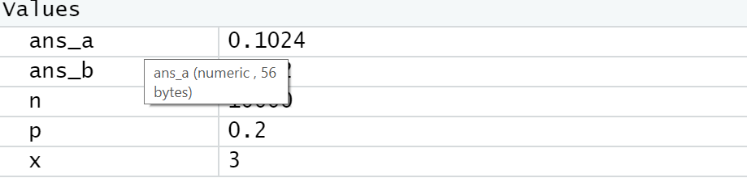
- Dari soal diketahui n = 10000
- Dengan menggunakan `fungsi mean()` dan `rgeomm()` pada r, maka rata-rata dari distribusi geometrik acak dapat dicari.
- Nilai tersebut kemudian dimasukkan ke dalam variabel `ans_b` dan ditampilkan

### c
Kesimpulannya:
- Hasil yang didapatkan a tetap, sedangkan b berubah di rentang 0.09~0.11.
- Meskipun hasil b berubah-ubah, nilainya mendekati nilai a.

### d
Foto hasil:
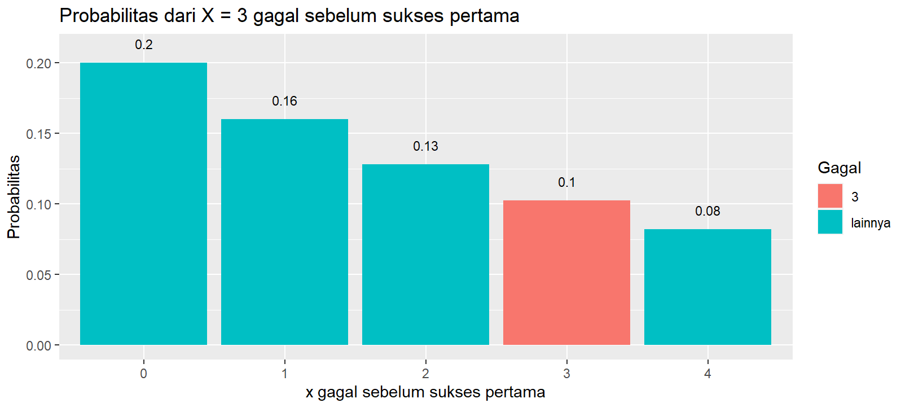
- Berdasarkan referensi yang tersertakan di code soal 1, maka diinstal 2 library tambahan `ggplot2` dan `dplyr`
- Range data untuk dibandingkan adalah saat nilai x = 0 sampai x = 4
- Hasil setiap range dihitung dan ditampilkan dalam bentuk histogram
### e
Foto hasil:
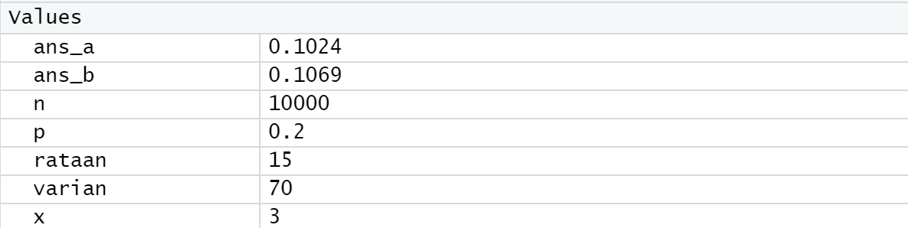
- Rata-rata didapatkan dengan membagi `x` dengan `p`
- menampilkan nilainya

## Nomor 2
**[Source Code Nomor 1](https://github.com/Graidy27/P1_Probstat_D_5025201188/blob/main/Nomor%202.R)**\
### a
Foto hasil:
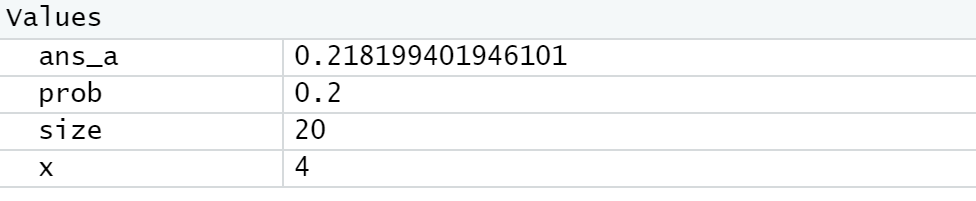
### b
Foto hasil:
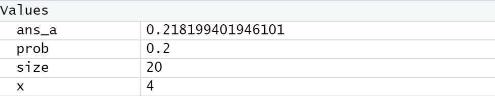
### c
Foto hasil:
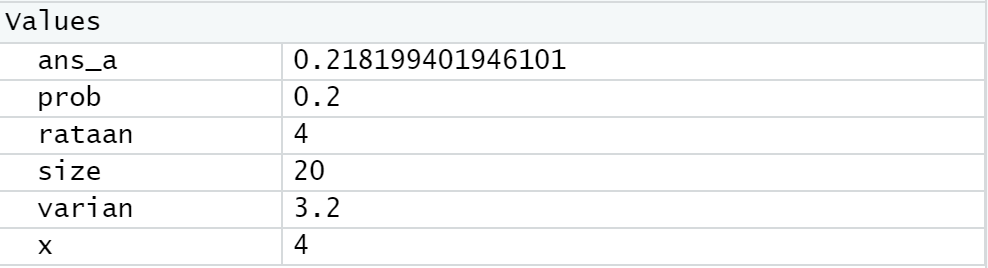

## Nomor 3
**[Source Code Nomor 1](https://github.com/Graidy27/P1_Probstat_D_5025201188/blob/main/Nomor%203.R)**\
### a
Foto hasil:
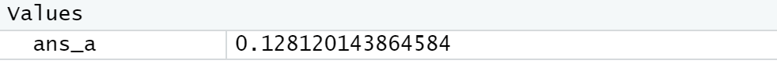
### b
Foto hasil:
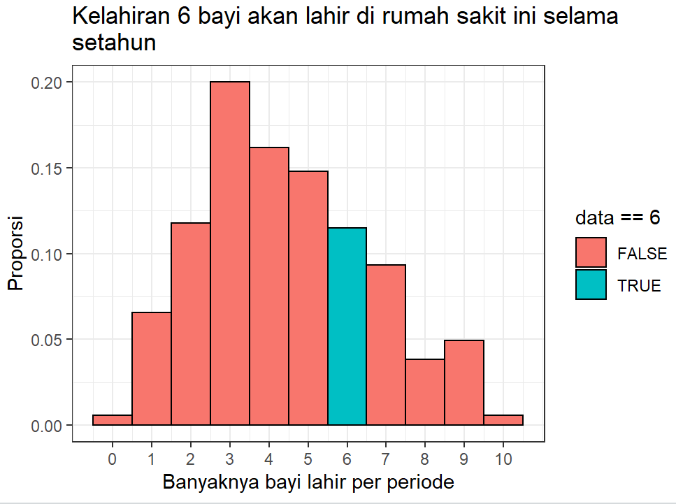
### c
### d
Foto hasil:
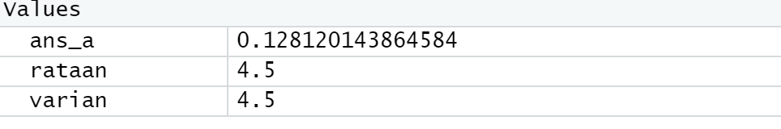

## Nomor 4
**[Source Code Nomor 1](https://github.com/Graidy27/P1_Probstat_D_5025201188/blob/main/Nomor%204.R)**\
### a
Foto hasil:
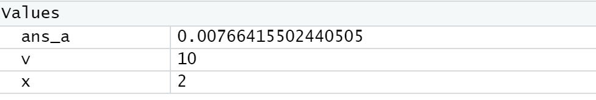
### b
Foto hasil:
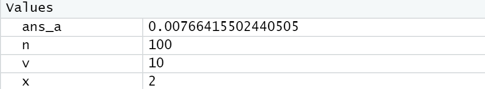
### c
Foto hasil:

## Nomor 5
**[Source Code Nomor 1](https://github.com/Graidy27/P1_Probstat_D_5025201188/blob/main/Nomor%205.R)**\
### a
Foto hasil:
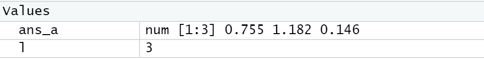
### b
Foto hasil:
- 100 bilangan

### c

## Nomor 6
**[Source Code Nomor 1](https://github.com/Graidy27/P1_Probstat_D_5025201188/blob/main/Nomor%206.R)**\
### a
### b
### c
