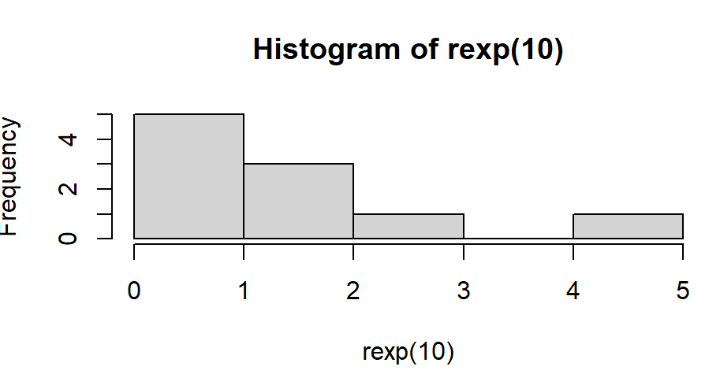
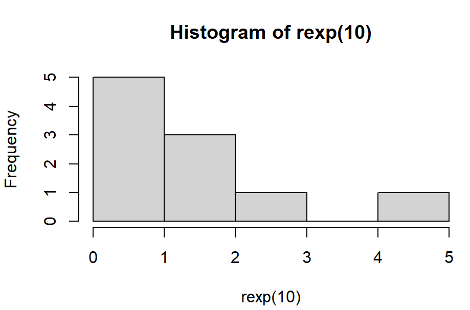
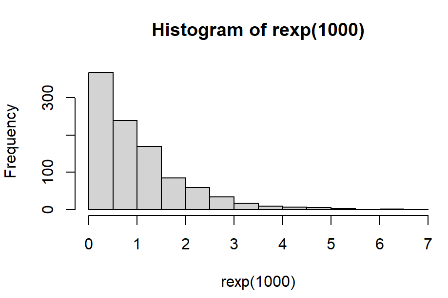
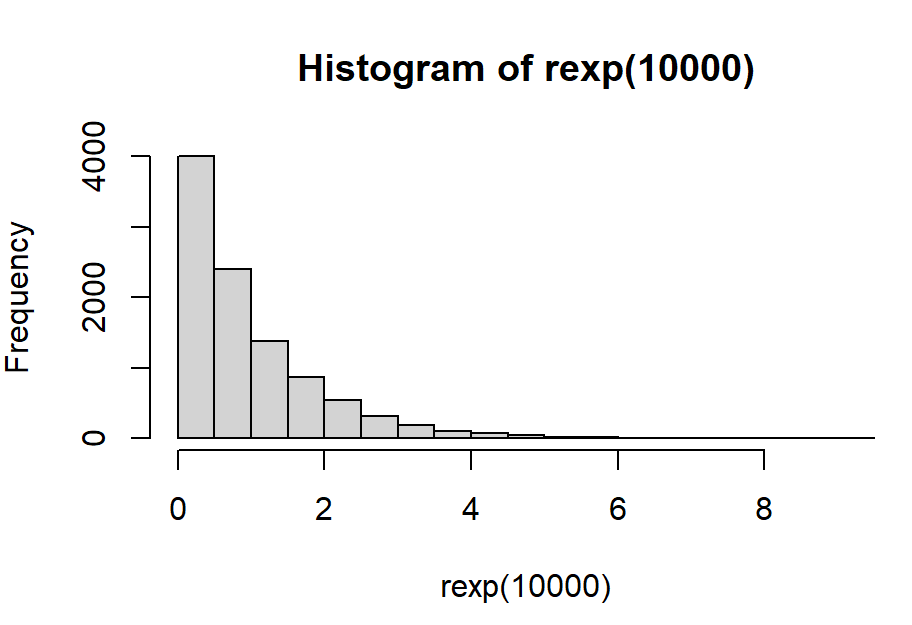
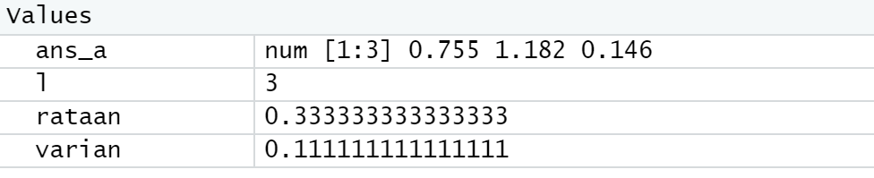
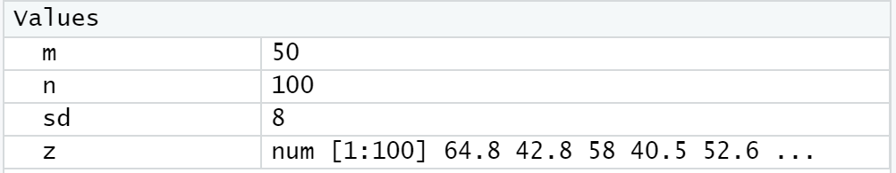
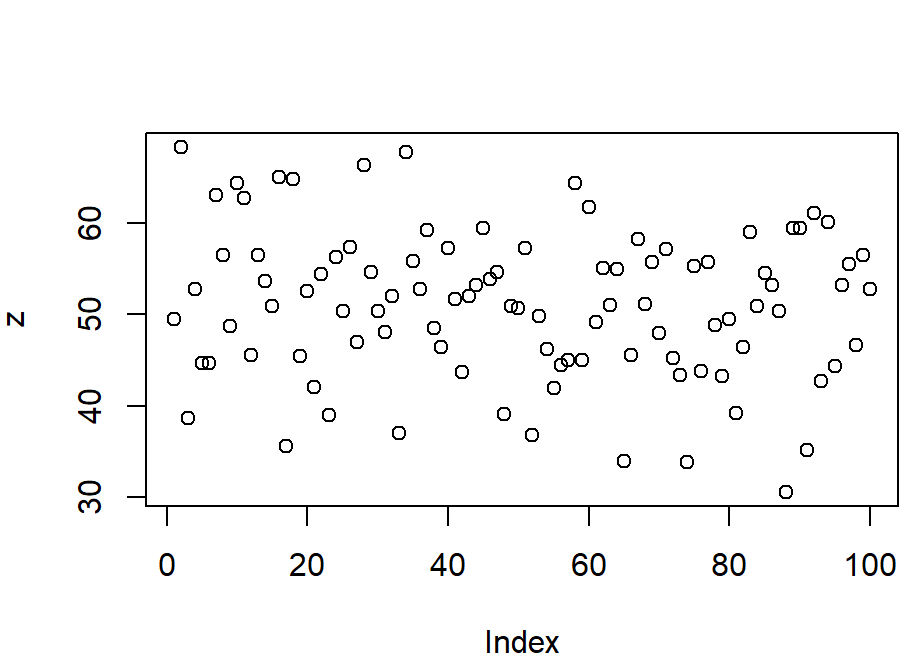
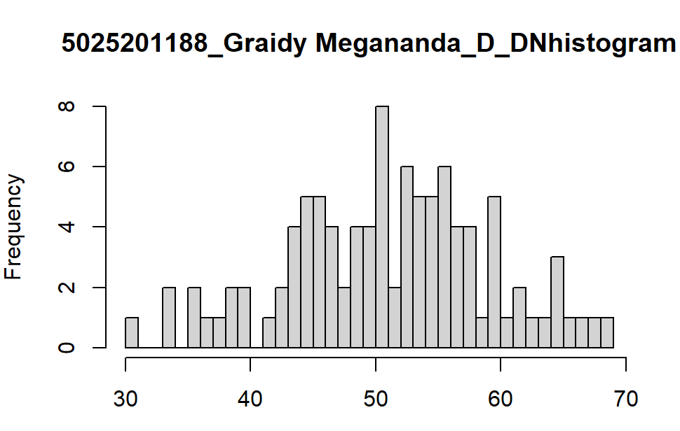
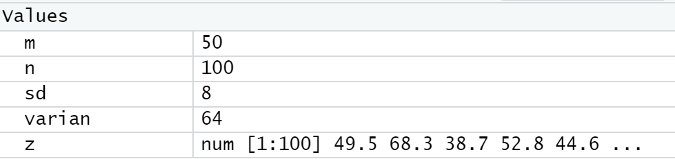

# Praktikum Probstat D 2021

Nama : Graidy Megananda\
NRP  : 5025201188\
Kelas: D

---

## Tabel Konten
- [Soal 1](#nomor-1)  
- [Soal 2](#nomor-2)
- [Soal 3](#nomor-3)
- [Soal 4](#nomor-4)
- [Soal 5](#nomor-5)
- [Soal 6](#nomor-6)

---

## Nomor 1
**[Source Code Nomor 1](https://github.com/Graidy27/P1_Probstat_D_5025201188/blob/main/Nomor%201.R)**
### a
Foto hasil:

- Dari soal diketahui x bernilai 3 dan probabilitas (p) bernilai 0.2.
- Dengan menggunakan fungsi bawaan `dgeom`, maka peluang distribusi geometrik dapat dicari. 
- Nilai tersebut kemudian dimasukkan ke dalam variabel `ans_a`

### b
Foto hasil:

- Dari soal diketahui n = 10000
- Dengan menggunakan `fungsi mean()` dan `rgeomm()` pada r, maka rata-rata dari distribusi geometrik acak dapat dicari.
- Nilai tersebut kemudian dimasukkan ke dalam variabel `ans_b` dan ditampilkan

### c
Kesimpulannya:
- Hasil yang didapatkan a tetap, sedangkan b berubah di rentang 0.09~0.11.
- Meskipun hasil b berubah-ubah, nilainya mendekati nilai a.

### d
Foto hasil:

- Berdasarkan referensi yang tersertakan di code soal 1, maka diinstal 2 library tambahan `ggplot2` dan `dplyr`
- Range data untuk dibandingkan adalah saat nilai x = 0 sampai x = 4
- Hasil setiap range dihitung dan ditampilkan dalam bentuk histogram
### e
Foto hasil:

- Rata-rata didapatkan dengan membagi `x` dengan `p`
- menampilkan nilainya

## Nomor 2
**[Source Code Nomor 2](https://github.com/Graidy27/P1_Probstat_D_5025201188/blob/main/Nomor%202.R)**
### a
Foto hasil:

- Dari soal didapatkan nilai `x`, `size`, dan `prob` berturut-turut adalah 4, 20, dan 0.2
- Dengan menggunakan fungsi `dbinom`, probabilitas distribusi binomial dapat dicari
- Menyimpan nilainya ke dalam variabel `ans_a dan menampilkannya`

### b
Foto hasil:

- Range data untuk dibandingkan adalah saat nilai x = 0 sampai x = 10
- Hasil setiap range dihitung dan ditampilkan dalam bentuk histogram
### c
Foto hasil:

- Rata-rata dapat dicari dengan membagi `size` dengan `prob`
- Menampilkan rata-rata

## Nomor 3
**[Source Code Nomor 3](https://github.com/Graidy27/P1_Probstat_D_5025201188/blob/main/Nomor%203.R)**
### a
Foto hasil:

- Nilai x dan lambda dapat diketahui dari soal dan berturut-turut bernilai 6 dan 4.5
- Dengan menggunakan fungsi `dpois`, nilai probabilitas distribusi poisson dapat dicari
- Menyimpan nilainya ke dalam `and_a` dan menampilkannya
### b
Foto hasil:

- Menggunakan `geom_histogram` untuk menampilkan histogramnya
### c
Kesimpulannya adalah hasil perhitungan dari poin a = 0.12812. Hal tersebut sesuai dengan hasil penggambaran histogram pada soal b, dimana berada di rentang 0.10~0.15
### d
Foto hasil:

- Nilai varian sama dengan nilai rata-rata dan Nilai rata-rata sama dengan nilai lambda

## Nomor 4
**[Source Code Nomor 4](https://github.com/Graidy27/P1_Probstat_D_5025201188/blob/main/Nomor%204.R)**
### a
Foto hasil:

- Dari soal didapatkan nilai `x` dan `v` berturut-turut adalah 2 dan 10
- Dengan menggunakan fungsi `dchisq` nilai fungsi probabilitas distribusi Chi-Square dapat dicari
- Nilainya disimpan ke dalam variabel `ans_a` dan ditampilkan
### b
Foto hasil:

- Dari soal diketahui `n` = 100
- Dengan memanfaatkan fungsi `rchisq` diperoleh data yang dapat ditampilkan menggunakan fungsi `hist`
### c
Foto hasil:

- Nilai rataan sama dengan nilai `v`
- Nliai varian sama dengan 2 kali nilai `v`

## Nomor 5
**[Source Code Nomor 5](https://github.com/Graidy27/P1_Probstat_D_5025201188/blob/main/Nomor%205.R)**
### a
Foto hasil:

- `set.seed` dapat digunakan agar data di buat bernilai tetap
- Dengan menggunakan fungsi `rexp` nilai fungsi probabilitas dari distribusi exponensial dapat dicari
- Menyimpan nilainya ke dalam `ans_a` dan menampilkannya
### b
Foto hasil:
- 10 bilangan random

- 100 bilangan random

- 1000 bilangan random

- 10000 bilangan random

 
Menggunakan fungsi `hist` untuk menampilkan histogram untuk 10, 100, 1000, dan 10000 bilangan random

### c
Foto hasil:

- Rataan dapat dicari dengan membagi 1 dengan lambda
- Varian dapat dicari dengan membagi rataan dengan lambda

## Nomor 6
**[Source Code Nomor 6](https://github.com/Graidy27/P1_Probstat_D_5025201188/blob/main/Nomor%206.R)**
### a
Foto hasil:\
Nilai z

- Dari soal didapatkan nilai n, median, dan sd berturut-turut adalah 100, 50, dan 8.
- Dengan menggunakan fungsi `rnorm`, maka nilai `z` dapat dicari. 
- Nilainya disimpan ke dalam variabel dengan nama `z` dan ditampilkan

Plot z

- Menampilkan grafiknya menggunakan fungsi `plot`
### b
Foto hasil:

- Menampilkan `z` dalam bentuk histogram
### c
Foto hasil:

- Varian dapat dicari dengan mengalikan `sd` dengan `sd`
- Menampilkan nilainya
