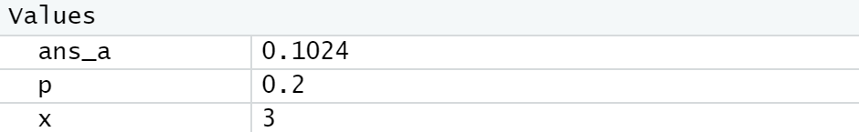

# Praktikum Probstat D 2021

Nama : Graidy Megananda\
NRP  : 5025201188\
Kelas: D

---

## Tabel Konten
- [Soal 1](#nomor-1)
- [Soal 2](#nomor-2)
- [Soal 3](#nomor-3)
- [Soal 3](#nomor-4)
- [Soal 3](#nomor-5)
- [Soal 3](#nomor-6)

---

## Nomor 1
**[Source Code Nomor 1](https://github.com/Graidy27/P1_Probstat_D_5025201188/blob/main/Nomor%201.R)**\
### a
Foto hasil:

- Dari soal diketahui x bernilai 3 dan probabilitas (p) bernilai 0.2.
- Dengan menggunakan fungsi bawaan `dgeom`, maka peluang distribusi geometrik dapat dicari. 
- Nilai tersebut kemudian dimasukkan ke dalam variabel `ans_a`

### b
Foto hasil:

- 

### c
### d
### e

## Nomor 2
### a
### b
### c

## Nomor 3
### a
### b
### c

## Nomor 4
### a
### b
### c

## Nomor 5
### a
### b
### c

## Nomor 6
### a
### b
### c
